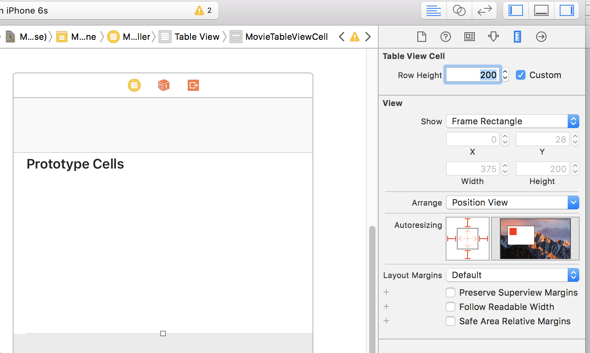
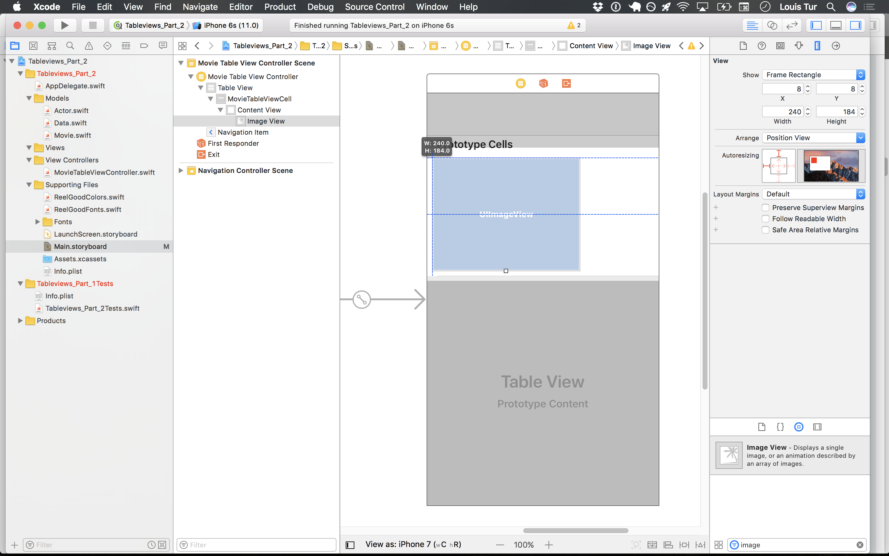
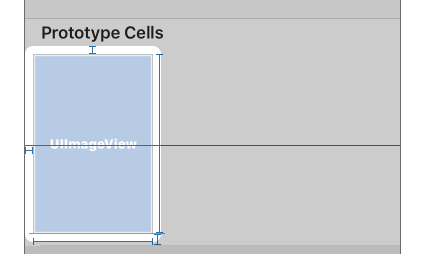
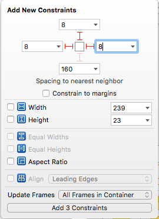
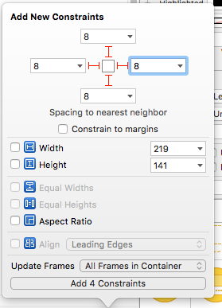
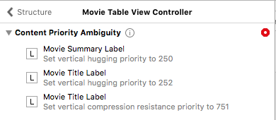
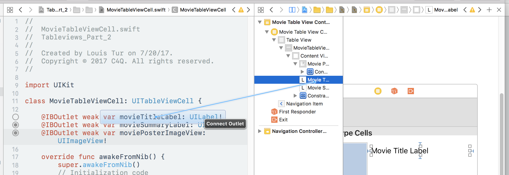

# AC3.2-Tableviews Part 2 **Intro to Customizing Tableviews**

---
### Readings (in Recommended Order)
1. [A Beginner's Guide to AutoLayout w/ Xcode 8 - Appcoda](http://www.appcoda.com/auto-layout-guide/)
2. [Understanding AutoLayout - Apple](https://developer.apple.com/library/content/documentation/UserExperience/Conceptual/AutolayoutPG/index.html#//apple_ref/doc/uid/TP40010853-CH7-SW1)
  1. [Anatomy of a Constraint](https://developer.apple.com/library/content/documentation/UserExperience/Conceptual/AutolayoutPG/AnatomyofaConstraint.html#//apple_ref/doc/uid/TP40010853-CH9-SW1)
  2. [Working With Constraints in IB](https://developer.apple.com/library/content/documentation/UserExperience/Conceptual/AutolayoutPG/WorkingwithConstraintsinInterfaceBuidler.html#//apple_ref/doc/uid/TP40010853-CH10-SW1)
  3. [Simple Constraints](https://developer.apple.com/library/content/documentation/UserExperience/Conceptual/AutolayoutPG/WorkingwithSimpleConstraints.html#//apple_ref/doc/uid/TP40010853-CH12-SW1)
  4. [Working with Self-Sizing Table View Cells](https://developer.apple.com/library/content/documentation/UserExperience/Conceptual/AutolayoutPG/WorkingwithSelf-SizingTableViewCells.html#//apple_ref/doc/uid/TP40010853-CH25-SW1)
3. [Array.sorted() - Apple Docs](https://developer.apple.com/documentation/swift/array/2905744-sorted)

###  Further Readings (Optional)
3. [Designing for iOS - Design+Code](https://designcode.io/iosdesign-guidelines)
4. [Extensions - Apple](https://developer.apple.com/library/content/documentation/Swift/Conceptual/Swift_Programming_Language/Extensions.html)
5. [Custom Fonts in Swift - GrokSwift](https://grokswift.com/custom-fonts/)

---
###Vocabulary

> TODO

---
### 0. Objectives
1. Create customized, self-sizing `UITableViewCell` using IB **(Interface Builder)**
2. Understanding *"minimally satisfying constraints"* in AutoLayout
3. Learning basics of iOS Design
4. Creating a simple `Extension` of a Foundation class
5. (Extra) Modifying a projects `.plist` to use custom fonts


---

### 1. We did *real good* with Reel Good

But now that the prototype is made, we need to kept the development cycle going strongly. Building apps is all about creating functional apps to a client's specification, and now they'd like to see a little more design in their app so that they can take it to their investors.

For the next [MVP](https://www.quora.com/What-is-a-minimum-viable-product/answer/Suren-Samarchyan?srid=dpgi), Reel Good needs a few key things:

1. The list of movies should display their movie poster art
2. The list of movies should be large enough so that the movie summary isn't cut off
3. The app needs to use Reel Good's brand colors
4. The app should have the Reel Good's icon in the navigation bar
5. (Extra) The app should use Reel Good's brand font, [Roboto](https://fonts.google.com/specimen/Roboto).

After talking over the changes with Reel Good, you get together with your development team and discuss the engineering changes that you'll need to implement to acheive this new MVP goal.

1. We're going to need a custom prototype `UITableviewCell` that will use `Autolayout` to expand to fit cover art and movie summary.
  1. This will be challenging because the cover art image size is not standardized and the summary text length varies
2. We're going to have to come up with a way to easily reference and reuse Reel Good's icons and brand colors to save us some time and typing
3. `UIButtonBarItem` will be used for adding an icon to the `UINavigationBar`
4. If we have time to add in Reel Good's font, we'll need to understand how to add keys to our project's `Info.plist`

---
### 2. Warm Up Exercises with Enums

You'll notice that if you run the project right after cloning it, it will look a little different than where we left off in part 1. Seems as though while we were sleeping, some of our overseas partner developers made some changes. So we're going to get the app into a new working spec before we begin.


Right now, we have just a list of `Movie` objects being displayed in a single section. What we want, however, is to group movies by their genre. We know `Movie` has a `genre` property, so we're going to do our best to sort on that (alphabetically). Sorting comes in two flavors for comparable elements: *ascending* and *descending*.

**Ascending** is when the smallest value element is first in a list, and the largest is last. **Descending** is the opposite, the largest value is first and the smallest is last. If we looked at an unsorted array of numbers, we can arrange them in both manners:

```swift
let unsorted = [5, 3, 7, 1, 9, 0, 2]

// smallest first
let sortedAscending = [0, 1, 2, 3, 5, 7, 9]

// largest first
let sortedDescending = [9, 7, 5, 3, 2, 1, 0]
```

An easy way to think of it is that each number represents the floor in a building. Going up from the Lobby (floor 0) up to the highest floor (floor 9), requires that you go *up/ascend* in an elevator. On the way *down*, you *descend* from 9 to 0.

When it comes to letters, smaller values come earlier in the alphabet and larger values are later. The alphabet is normally written in an *ascending* manner, going from `a` to `z`. If we were going to recite it `descendingly`, we'd do it from `z` to `a`. Thus, an ascending-order, alphabetical list will list `Movie.genre` from `a` to `z`.

> **Developer's note:** Capitalized letters are of lower value than lowercase. Meaning, `Z` is a lower value than `a`. See [this](http://ascii.cl/) for a full list of ascii values, and [this](https://en.wikipedia.org/wiki/ASCII) for more information on the value mapping.

Swift, like many higher level languages, comes with a built-in `sorted()` method that will arrange elements in a collection ascendingly (by default). In pseudo code, all we'd need to do to sort our `[Movie]` is to do

```
  movieData.sort(on: genre)
```

In practice this is a little bit more work. So I'll show you how its done using a separate example. Then you will be asked to implement what you've learned on our actual `[Movie]`.

#### Sample Sort

Using our `[Int]` example from before, we can see that simply calling `.sorted()` on it will return a new array with all of its elements sorted in ascending order:

```swift
let unsorted = [5, 3, 7, 1, 9, 0, 2]

let sorted = unsorted.sorted()
print(sorted) // prints out [0, 1, 2, 3, 5, 7, 9]
```

What's important to note here, is that there is a little bit of magic happening in the background we don't need to know just yet. But think about this: *How does sorted() know what number is bigger than the other? What exactly is driving that comparison?*

There's a longer form of the `sorted()` method shown above. It's done by using `sorted(by:)`, and passing in some code to do the actual evaluations. What that would look like with the above example is:

```swift
let unsorted = [5, 3, 7, 1, 9, 0, 2]

// 1.
let sorted = unsorted.sorted(by:  { (a: Int, b: Int) -> Bool in
    // 2.
    if a > b {
        return false
    } else {
        return true
    }
})

```

1. `sorted(by:)` takes a closure (just a block of code) to do it's evaluations. Here, `a` and `b` represent the integers in the array that will be compared to one another. The closure is also going to return a `Bool` value based on that comparison made.
2. To do the actual comparison, we use the inequality operator `>`. The result of this comparison is to determine which item should be first. Here we're saying that if `a > b` (if the first element compared is larger than the second), to return `false` because we do not want this to be in increasing order. We return true otherwise, to indicate that `b` should be before `a`

This breaks down like this:

```swift
let unsorted = [1, 3, 2]
let sorted = unsorted.sorted(by: { (a: Int, b: Int) -> Bool in
      print("A is : \(a), B is \(b)")

      if a > b {
        print("A is larger than B, we do not want this order. Do not switch A and B")
        return false
      }
      else {
        print("B is larger than A, we do want this order. Switch A and B")
        return true
      }
  })

// before: [1, 3 , 2]
// A is : 3, B is 1
// A is larger than B, we do not want this order. Do not switch A and B
// after: [1, 3, 2]

// before [1, 3, 2]
// A is : 2, B is 3
// B is larger than A, we do want this order. Switch A and B
// after [1, 2, 3]

// before [1, 2, 3]
// A is : 2, B is 1
// A is larger than B, we do not want this order. Do not switch A and B
// after: [1, 2, 3]

print(sorted) // [1, 2, 3]
```

This is a fairly simple example, so feel free to experiment in a playground.

#### Sorting `Movie` by `genre`

Unlike an array of `Int` we can't directly call `.sorted()` on `[Movie]` because Swift doesn't know how we should compare each object. It doesn't know if it should use, `genre`, or `title`, `summary`, or something entirely different to make value comparisons. Though, we can absolutely find a way to sort `Movie` from within the `sorted(by:)` closure, because we have access to each of the `Movie` objects.

In `viewDidLoad` update the value of `self.movieData` such that the array itself is sorted in ascending order by genre using `sorted(by:)`. Additionally, add in another string interpolation to display the `Movie` genre in the cell.

<br>
<details><summary>Hint 1</summary>
<br><br>
The type of the elements in the closure changes based on the elements in the array you're sorting. Meaning, <code>a, b</code> are not <code>Int</code>
<br><br>
</details>

<br>
<details><summary>Hint 2</summary>
<br><br>
You wont be able to do something like <code>Movie > Movie</code>,  but you can use its property of <code>genre</code>
<br><br>
</details>

<br>
<details><summary>Hint 3</summary>
<br><br>
If your sorting ends up descending, it's fine. That ends up being an easy, single operator fix.
<br><br>
</details>

<br>
<details><summary>Answer</summary>
<br><br>
<code>
    self.movieData = self.movieData.sorted(by: { (a: Movie, b: Movie) -> Bool in <br>
      return a.genre > b.genre ? false : true <br>
    })
</code>
<br><br>
</details>
<br>


---

### 2. A little bit of background on our `UITableviewCell`

Recall in the previous MVP, we had to make a few changes to the `UITableviewController` in storyboard befor being able to use it. For one, we changed it's type to `.subtitle`, which gave us a `.textLabel` and `.detailTextLabel` to use to put info in. If you read the [documentation](https://developer.apple.com/library/content/documentation/UserExperience/Conceptual/TableView_iPhone/TableViewCells/TableViewCells.html#//apple_ref/doc/uid/TP40007451-CH7) (scroll to **Figure 5-4** on the page) on table view cells, you'll see an example of what a cell in this style can look like.


But this is a little too limiting for us, and we're going to design our own cell such that we follow Apples standards for design (explained well in [design+code](https://designcode.io/iosdesign-guidelines)):

1. There is a standard 8pt margin around all the elements in the cell
2. The `Movie.title` text is 17pt, and the `.summary` text is 12pt
3. The movie poster image is centered on the y-axis, the title is aligned to the top of the cell, and the description is just below that, with an 8pt margin


When attempting to using self-sizing `UITableviewCells` there is are a few critical things to remember, but the first:
- ADD AND ALIGN YOUR VIEWS TO THE CELL's `.contentView` PROPERTY!

---

### 2. Customizing `UITableviewCell` in Storyboard

1. Create a new `UITableViewCell` subclass by going to File > New > File... and selecting `Cocoa Touch Class`
  - Have this subclass from `UITableViewCell` and name the new class `MovieTableViewCell`
  - *If you'd like to be thorough: before saving, create a new Folder called "Views" to create the file in. Then right-click the `MovieTableViewCell.swift` file and select "New Group from Selection" and name the new group "Views"*
2. Go into storyboard, select the protoype cell, switch "Style" to "Custom" (note that the prototype cell in the storyboard changes) and switch its class type to `MovieTableViewCell` in the "Identity Inspector" in the Utilities pane.
  - 
3. Open the *Utilities Area* and select the *Attributes Inspector*
4. Switch to the *Size Inspector* in the *Utilities Area* and give the `MovieTableViewCell` a custom row height of 200pt to give us a little room to work with (note: this will only be 200pts in the storyboard, and at runtime, our autolayout guides will expand/shrink as needed)
  - 
5. From the *Object Library*, drag over a `UIImageView` into the `contentView` of the cell
  - 
6. Align the `UIImageView` to the left side of the cell, such that the alignment lines show up on the top, left, and bottom sides of the imageview.
  - 
7. Select the imageView, click on the *Align* button, and select "Vertically in Container" and switch "Update Frames" to "All Frames in Container"
  - This will ensure that the imageView will be aligned vertically in the content view (sets imageView.centerY `NSLayoutAttribute` to contentView.centerY)
  - Changing the "Update Frames" option makes sure that the storyboard updates the UI to match these changes. If you don't do this, you could have the proper constraints in place, but Xcode will warn you that the constraints you've applied don't match what's being seen in storyboard.
  - 
8. Next, with the imageView still selected, click on the *Pin* button and add the following:
  - 8pt margin to top, left and bottom
  - Width of 120, Height of 180
  - 
9. Its possible that the storyboard hasn't updated its views to match the constraints you've set, so you may need to click on *Resolve Autolayout Issues* and select "Update Frames".
  - When selecting this, Xcode will look at the constraints you've set and try to update the storyboard elements to match their constraints. If you've done everything right up until this point, you should no longer see any warnings or errors in storyboard
  - *Some Advice: Using the storyboard can be quite frustrationg at times. I would highly recommend that if you make an error somewhere along the line, to just select the problematic view, click on "Clear Constraints" and just start over. It's very difficult, especially when starting out, to resolve layout issues when you have many existing (and potentially) conflicting constraints in place. Once you've become a little experienced with it, you can try to resolve them on your own. But for now, you may find that just clearing the constraints is ultimately faster.*
  - 
10. Now, add a `UILabel` to the right of the `UIImageView` with the following constraints:
  - 
  - 8pts from top, left, right
  - 17pt font
  - Left aligned
  - Name it: Movie Title Label
11. Add a second UILabel below the first:
  - 
  - 8pts from the top, left, right and bottom
  - Number of lines = 0
  - Justified alignment
  - Named: Movie Summary Label
  - 12pt font, Gray color (any)
12. You may now notice an error about `verticalHuggingPriority` and `verticalCompressionResistence`... let's take a look at these two properties for a moment



#### Content Hugging/Compression Resistance ([CHCR](https://developer.apple.com/library/content/documentation/UserExperience/Conceptual/AutolayoutPG/WorkingwithConstraintsinInterfaceBuidler.html#//apple_ref/doc/uid/TP40010853-CH10-SW2))
These aren't the easiest concepts to understand, and I think in large part is due to their naming. But thanks to one very perfectly succinct [StackOverflow answer](http://stackoverflow.com/a/16281229/3833368), it's a bit easier:

- **Content Hugging**: How much content does not want to grow
- **Compression Resistance**: How much content does not want to shrink

Meaning:
- The higher the **Content Hugging** value, the more it will try to keep its size you set in IB. Think of it as how tightly the edges of a view are hugging what's inside the view (like how the edges of a `UILabel` are hugging the text inside of it).
- The higher the **Compression Resistance** value, the more it will try to expand the bounds you set in IB.

*Note:* These values are set *relative* to the views that surround it. Meaning, these properties will only matter in cases where constraints do not define an exact width/height for a view, and rather, expect a view to expand/contract based on the sizes of the views around it.

#### Exercise: Fixing the CHCR Errors

In our case, we want the movie title `UILabel` to keep a consistent size, both in width and height. The movie summary `UILabel`, however, should expand **vertically** as much as needed to accomodate all of the movie's text, but stay pinned to the left, top and right. So conceptually, the *content hugging* of the movie title label's width and height should be high, but the *content compression resistance* of the movie summary label should be low (to let it grow) vertically. With this in mind, let's update our views...

<br>
<details><summary>Hint 1</summary>
<br><br>
You really only need to change one of the labels's content hugging for the errors to resolve
<br><br>
</details>
<br>

<details><summary>Answer</summary>
<br><br>
Make the <code>vertical content hugging</code> priority of the <code>movieSummaryLabel</code> any value less than the
<code>movieTitleLabel</code>'s  <code>vertical content hugging</code>

<br><br>
</details>
<br>

---
### 3. Linking Storyboard Elements to a custom `UITableViewCell`
With our prototype cell's constraints completed, now its necessary to link it up so our project uses the new prototype.

However is most comfortable (typing and/or ctrl+dragging), add three `IBOutlet`s to `MovieTableViewCell` and make sure they are linked to your prototype cell. Name the elements `movieTitleLabel`, `movieSummaryLabel`, and `moviePosterImageView`

```swift
    @IBOutlet weak var movieTitleLabel: UILabel!
    @IBOutlet weak var movieSummaryLabel: UILabel!
    @IBOutlet weak var moviePosterImageView: UIImageView!
```


>>> TODO UPDATE THIS STALE CODE

Next, we'll need to update our code in our `MovieTableViewController`'s `cellForRow` delegate function:

```swift
  // just below our guard statement
  if let movieCell: MovieTableViewCell = cell as? MovieTableViewCell {
    movieCell.movieTitleLabel.text = data[indexPath.row].title
    movieCell.movieSummaryLabel.text = data[indexPath.row].summary
    movieCell.moviePosterImageView.image = UIImage(named: data[indexPath.row].poster)
    return movieCell
  }
```

Great! Now let's run and see our new cell in action

Oh, something's wrong... remember before I mentioned that there are a few critial things you need to do in order to get self-sizing cells with autolayout? Well, constraining everything relative the the `contentView` is one, but there are two more:

1. You need to set the `tableView.rowHeight` property to `UITableViewAutomaticDimension`
2. You need to set the `tableView.estimatedRowHeight` property to any value (but as close to actual size as possible)

So add the following to `viewDidLoad`, just before we parse our `Movie` data objects

```swift
  self.tableView.rowHeight = UITableViewAutomaticDimension
  self.tableView.estimatedRowHeight = 200.0
```
And now re-run the project. Much better right?

Depending on the iPhone model your simulation is running on, you probably notice a problem with the summary text: it's being cut off! While it's true that our summary text label will expand as needed for text, there are two constraints that are holding the cell at a specific height. See if you can figure out which two those are.


*Hint/Reminder: The height of the cell is determined by a single, unbroken chain of constraints that describe the vertical relationships of the views. Think about what is giving our cell it's height (it's not those two tableview properties we just set, FYI)*


---

### 4. Extensions and Navigation Item Style Changes
In brief, an Extension allows you to give more functionality to an existing class without having to change that class's file. This is pretty useful if you want to add some new property or function to an existing class - even a built-in Apple class, or a 3rd party library's. A lot of times developers will extend an existing Foundation class to do some task that they need to do repeatedly in their app, but don't need to create an entire class to do.

For example, say we wanted to create a `UIView` with rounded corners and a green background. We could write this class:

```swift
  class GreenView: UIView {
    override init(frame: CGRect) {
      super.init(frame: frame)
      self.backgroundColor = UIColor.green
      self.layer.cornerRadius = 5.0
    }

    required init(coder: aDecoder) {
      super.init(coder: aDecoder)
    }
  }

  // creates a UIView with green background and rounded corners
  let greenView: GreenView = GreenView(frame: CGRect.zero)

  ```

  or we could create an Extension of `UIView`:
  ```swift
  internal Extension UIView {
    func greenCorners() {
      self.backgroundColor = UIColor.green
      self.layer.cornerRadius = 5.0
    }
  }

  // creates a UIView with green background and rounded corners
  let greenView: UIView = UIView(frame: CGRect.zero).greenCorners()
  ```
You save a little bit of code, but the potential savings isn't immediately obvious. Because `.greenCorners()` can be called on any existing `UIView`, if you have a project you've been working with for months, all you would need to do is append this function to the views you wanted to use this with without having to swap all instances of `UIView` with `GreenView`.

**But not only this!!** Since this function extends `UIView`, it's available to *all classes that subclass from UIView.* So if you had `UILabel`s, or `UIButton`s, etc.. that needed a green background and rounded corners, you could run this function on those as well!

```swift
  // creates a UILabel with green background and rounded corners
  let label: UILabel = UILabel().greenCorners()

  // creates a UIButton with green background and rounded corners
  let button: UIButton = UIButton().greenCorners()
```

Extensions can be extremely useful and more flexible that creating your own class or set of functions. They can also be clear in their intent so long as you name them well.

#### Adding a simple `UIColor` extension
Since we know that Reel Good is going to want to use their official brand colors in a lot of places in their app, it makes sense to think ahead and try to save yourself some time with typing. It's really not a big deal to set a UI element's background color, here and there (`view.backgroundColor = UIColor.green`, `label.textColor = UIColor.purple`, etc..). But as programmers, we strive for modularity, re-usability, and maintainability. Here's what I mean:

```swift
  let reelGoodGreen: UIColor = UIColor(red: 109.0/255.0, green: 199.0/255.0, blue: 39.0/255.0, alpha: 1.0)
  let reelGoodGray: UIColor = UIColor(red: 85.0/255.0, green: 85.0/255.0, blue: 85.0/255.0, alpha: 1.0)
```

That is what the code looks like to define the exact color of green and gray that appears in Reel Good's logo. Seems reasonable that we can just copy/past that line into each class we need, or put it someone once and give it the `open` access modifier to be available everywhere in our project. But, I'd like to be able to call this color in the same way that we can for some of `UIColor`'s standard available colors (`.purple`, `.red`, `.blue`, etc..).

So instead, let's create a `UIColor` extension with `static let`s for two new values, `reelGoodGreen` and `reelGoodGray`.

Note: If you're defining new constants for classes originally defined in Objective-C, you'll need to add the `@nonobjc` attribute as well.


#### Changing the `UINavigationBar` appearance
Here are some guiding rules:
1. To change the style of a `UINavigationController`, you will need to make changes to its `.navigationBar` property
2. `.tintColor` is used to change the color of navbar icons and button text
3. `.barTintColor` is used to change the background color of the navbar
4. `titleTextAttributes` is used to change the font of the navbar title
  - This property is a dictionary of key/value pairs that correspond to different attributes of the text ([see here for full list](https://developer.apple.com/reference/foundation/nsattributedstring/1652619-character_attributes)). The most common I use are:
    - `NSForegroundColorAttributeName` : `UIColor` (corresponds to text color)
    - `NSFontAttributeName` : `UIFont` (corresponds to font style)

We're going to add the associated code to update the navBar inside of `UIViewController`'s `viewWillAppear` function, which is called just before the view controller's views are presented on screen. Often times you'll see small UI changes in this function, which is why we're adding the code here.

#### Adding a `UIBarButtonItem` to the `UINavigationBar`
This is fairly straightforward, with the trickiest part being sizing the image you're going to use to fit your navBar properly. In this case, the project includes an icon that's already sized at about 60pt for its @2x size.

---
### 5. (Extra) Adding Custom Fonts

To add your own set of fonts for an app, you'll need:

1. The actual font files (can be different file types, such as `.otf` and `.ttf`)
2. To add the font files to your *application bundle*
2. To add the `Fonts provided by application` key to your `.plist`
  3. To add the names of the fonts (manually) to this plist as well


Following the above steps, you can test to make sure your app sees the font by add the following line to your `AppDelegate` didFinishLaunching function:

`print(UIFont.familyNames)`

You should see `Roboto` among the fonts listed in the console log. Then if you wanted to see the styles you can use, use this line (after making sure `Roboto` exists):

`print(UIFont.fontNames(forFamilyName: "Roboto"))`

You will see `["Roboto-Light", "Roboto-Black", "Roboto-Bold", "Roboto-Regular"]` if all has been done properly.

Once you've validated your fonts, change your `NSFontAttribute` value from before, and update your storyboard's prototype `MovieTableViewCell` (use Roboto-Regular, 17pt for the title text and Roboto-Light, 12pt for the summary text)

---
### 6. Revealing the MVP to Reel Good


"Stunning!" - Reel Good, CEO

"... this app is becoming so beatiful..." - Reel Good, Lead Designer

"How much is this costing us?" - Reel Good, CFO

"The board will be thrilled" - Reel Good, Investor Relations

"It's OK." - Reel Good, Crusty iOS Engineer


Great work on this MVP, but now Reel Good is expecting a lot more out of the next iterration. They want a full screen detail view on the movie and some design tweaks. On top of this, your engineering team has decided that the code base needs some clean up before it gets to large! The next stage of this project will be even more challenging and there's no time to rest on laurels.

---
### 7. Exercises

While Reel Good's Lead Designer loved that you were able to match their specs exactly, they're not entirely sure they love their original design and want you to make two more types of cells that they can test. They've sent over some screenshots of their design mock ups and have asked you to recreate:


#### Alternative Version 1


---

### Alternative Version 2


What's worse, is that they expect ALL of these designs to look good in landscape and protrait, so you're going to need to make sure your constraints are very well engineered and that the app supports landscape (left and right) and portrait.

---

(Extra credit)
Our engineering team has decided that it would be best if the designers could see all three cell designs at once somehow... but they're leaving it up to you as to how to design the app to do this. Maybe three sections, each with a prototype cell? Or a function that changes cell type and reloads the table view? Or embedding a tabbar with three tabs, each with a different tableviewcontroller and cell type? Any way you deem fit, go that direction.

